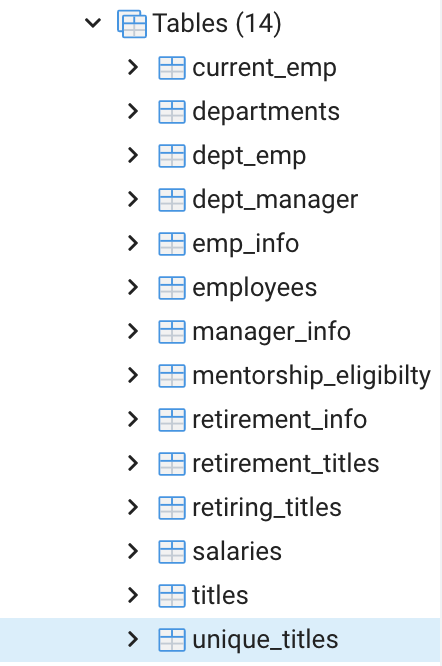

# **Pewlett-Hackard-Analysis**

## **Overview of Project**
The purpose of this analysis is to develop skills in SQL by undertanding structure of tables using `ERD (Entity Relationship Diagramas)` that help to visualize the databases for holding data. 
During the challenge Visual Studio Code (VS Code) helped to create SQL queries by using a code editor with the ability to execute the queries that was created. 

## **Results**
The queries results are lists that answer questions about insights of the data. SQL is a great tool to do research and identify the `Primary Key` and `Foreign Key` of the databases. The list are set up on QuickDBD link: [Free Diagrama](https://app.quickdatabasediagrams.com/#/d/1iEot4) as it is shown below:

ERD Retirement Lists

## **Summary** :white_haired_woman::person_white_hair::older_man::older_woman:
PdAdmin program allowed us to use several SQL statements such as `GROUP BY`, `ORDER BY`, differnt forms of joints `SELECT DISTINCT`, `COUNT` with the purpose to retrive information that is esential for the company in order to verify expenses on retire employees.
After running some queries, there were designed 14 tables that are saved in the Data Folder.

Final Results:

